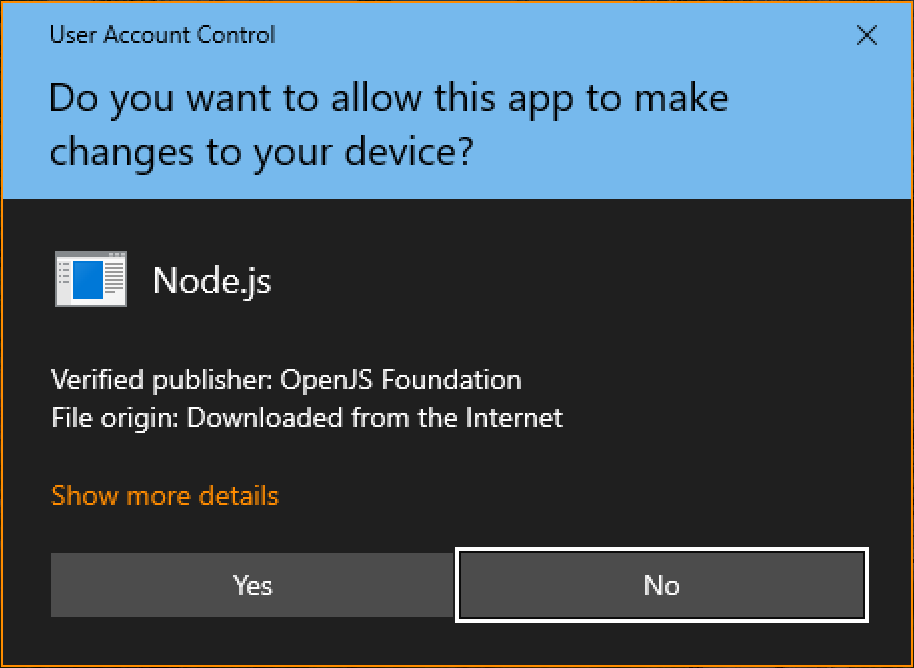
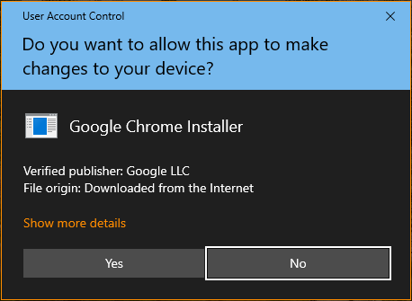

# Yahoo Puppeteer

End Goal: Migrating Yahoo Mail contents to Local OutLook (and to forward the emails to another account as a BackUp measure), automatically using Puppeteer.

Yahoo at roughly the start of Coronavirus Disease (COVID-19) Pandemic, changed access to their free email account from POP3/IMAP/SMTP into Web-Based only.
This is a bad move for someone who needs to archive communicated information and documentation sent per email.
After some researches on my own, I found a way to export the raw content of the email into Local OutLook, which I am trying to automate as much as possible with Puppeteer.

This repository documented learning journey with some side-examples, using Microsoft Windows OS.
Note that Microsoft Windows is notoriously Manual-Based OS. It is way harder to build CLI scripts (i.e. batch files) on Windows' Command Line Interpreter.

I have tried to suppress as much as possible the required human-interaction, however there are still a few left which human-interactions are still needed.
During the installation of the required library (i.e. Node.JS) and the browser (Google Chrome), user still needs to grant permission to do installation.
Failing to respond in time (i.e. there is timeout enforced by the Windows OS), or answering/clicking anything else but "Yes" button, will cause the installation to fail.






<br><br><br>

***

Snippet for Node.JS, Puppeteer and Chrome Browser installations:

`cd %USERPROFILE%\Downloads && curl -kLO --retry 333 -H "Cache-Control: no-cache, no-store, must-revalidate" -H "Pragma: no-cache" -H "Expires: 0" https://raw.githubusercontent.com/gjwdyk/YahooPuppeteer/main/InstallWrapper.bat && call InstallWrapper.bat`


<br><br><br>

***

Snippet only for Arcadia-Example script (once you have Node.JS, Puppeteer and Chrome Browser installed):

`cd %USERPROFILE%\Downloads && curl -kLO --retry 333 -H "Cache-Control: no-cache, no-store, must-revalidate" -H "Pragma: no-cache" -H "Expires: 0" https://raw.githubusercontent.com/gjwdyk/YahooPuppeteer/main/arcadia-example.js && call node arcadia-example.js`


<br><br><br>

***

Snippet combining Node.JS, Puppeteer, Chrome Browser installations and also for Arcadia-Example script:

`cd %USERPROFILE%\Downloads && curl -kLO --retry 333 -H "Cache-Control: no-cache, no-store, must-revalidate" -H "Pragma: no-cache" -H "Expires: 0" https://raw.githubusercontent.com/gjwdyk/YahooPuppeteer/main/InstallArcadiaWrapper.bat && call InstallArcadiaWrapper.bat`


<br><br><br>
```
╔═╦═════════════════╦═╗
╠═╬═════════════════╬═╣
║ ║ End of Document ║ ║
╠═╬═════════════════╬═╣
╚═╩═════════════════╩═╝
```
<br><br><br>


